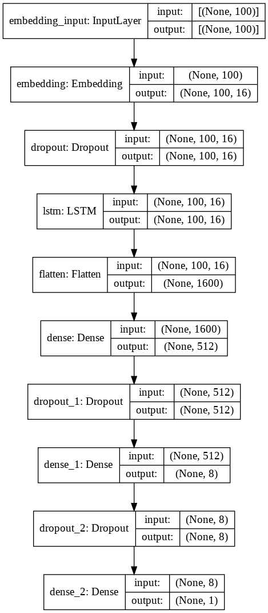

# Clickbait Detection Web App

This is a web app which detects whether or not a headline or video title is clickbait. 

This web app uses LSTM as the backend model. 

The dataset used to train this model can be found [here.](https://www.kaggle.com/amananandrai/clickbait-dataset)

#### Model Architecture

## Demo

https://user-images.githubusercontent.com/48136910/127974906-54afe97b-e8b1-49a8-9ee4-a9caf8b0364d.mp4

